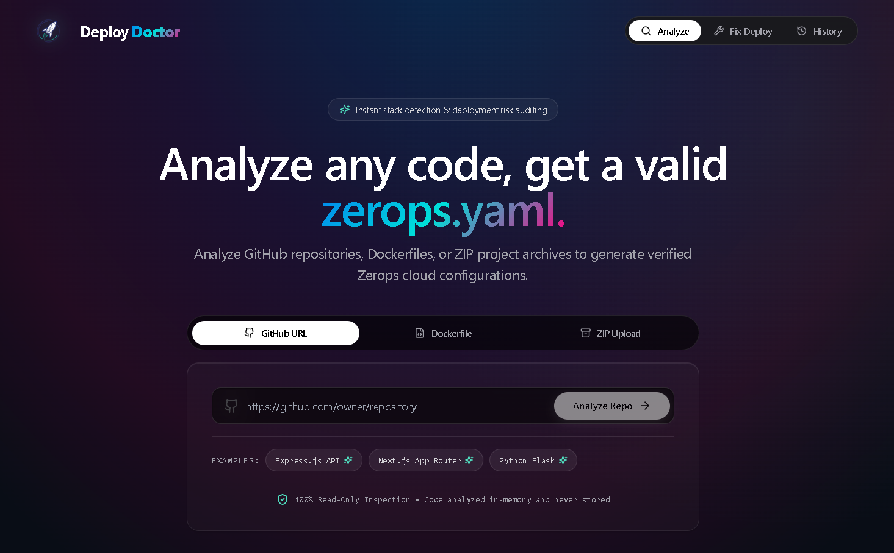

<div align="center">

  

  # Deploy Doctor

  **Automated Zerops Cloud Readiness Engine & Production YAML Generator**

  [](https://nextjs.org/)
  [](https://expressjs.com/)
  [](https://www.postgresql.org/)
  [](https://zerops.io/)

  Instant deployment readiness scoring, automated risk diagnostics, and production-ready `zerops.yaml` configuration generation for any GitHub repository, Dockerfile, or ZIP archive.

</div>

---

## Overview

**Deploy Doctor** acts as an automated diagnostic engine for cloud deployments on Zerops. It scans public GitHub repositories, raw Dockerfiles, or local `.zip` archives to calculate a Deployment Readiness Index (0–100 health score), diagnose configuration risks, and generate optimized, production-ready `zerops.yaml` specifications.

---

## Key Features

- **Universal 9-Stack Detection**: Automatic analysis and production YAML generation for Node.js (`nodejs@22`), Python (`python@3.12`), Go (`go@1.22`), PHP (`php@8.3`), Java (`java@21`), Rust (`rust@1.77`), Ruby (`ruby@3.3`), Elixir (`elixir@1.16`), and Static sites.
- **Deployment Readiness Index**: 0–100 score gauge categorizing production readiness (`90-100 Ready`, `70-89 Caution`, `<70 Critical Risks`).
- **Production Spec Generator**: Generates optimized Zerops specifications with deterministic lockfile installation, static SPA decoupling, WSGI/ASGI multi-worker configuration, and minimal runtime binary targeting.
- **Automated Build Log Fixer**: Real-time error log parser that diagnoses deployment failures (e.g., `missing script: start`, port mismatches, memory errors) and auto-patches `zerops.yaml`.
- **One-Click Zerops Cloud Deployment**: Direct REST API integration (`/api/deploy`) to create projects, provision services, and launch live `.zerops.app` instances.
- **Interactive Live Editor**: Customize runtime bases, service names, ports, and environment variables with real-time YAML validation.
- **Diagnostic Audit History**: Searchable audit log backed by PostgreSQL (with automatic in-memory fallback).
- **CLI Handoff**: One-click copy for `zcli project service import zerops.yaml` and `zcli push` workflow scripts.

---

## Architecture & System Topology

Deploy Doctor is built as a high-availability monorepo hosted on Zerops Cloud:

```
+-------------------------------------------------------------------+
|                        CLIENT BROWSER / USER                      |
+-------------------------------------------------------------------+
                                 │
                    HTTP GET / POST (Port 3000)
                                 ▼
+-------------------------------------------------------------------+
|               ZEROPS SERVICE 1: WEB (Next.js 15)                  |
|   - App Router (Landing, Diagnostic Report, History UI)           |
|   - Next.js API Proxy Rewrites (/api/* -> http://api:4000/api/*)  |
+-------------------------------------------------------------------+
                                 │
                    Internal HTTP REST (Port 4000)
                                 ▼
+-------------------------------------------------------------------+
|               ZEROPS SERVICE 2: API (Express.js)                  |
|   - Multer 10MB Body Buffer & File Filtering (.zip / Dockerfile)  |
|   - Global JSON Error Middleware & CORS Protection                |
+-------------------------------------------------------------------+
         │                                         │
   Cache Check                              Analysis Engine
         │                                         │
         ▼                                         ▼
+-----------------------+               +--------------------------+
| IN-MEMORY RESPONSE    |               | MULTI-LANGUAGE DETECTOR  |
| - Fast In-Memory Cache|               | - Node, Python, Go, PHP  |
| - Bounded LRU Eviction|               | - Java, Rust, Ruby, etc. |
+-----------------------+               +--------------------------+
                                                   │
                                            Persistence
                                                   │
                                                   ▼
                                        +--------------------------+
                                        | ZEROPS SERVICE 3: DB     |
                                        | - PostgreSQL 16 Managed  |
                                        | - Connection-Pooled DB   |
                                        | - Memory Map Fallback    |
                                        +--------------------------+
```

---

## Technology Stack

| Layer | Technologies Used |
| :--- | :--- |
| **Frontend** | Next.js 15 (App Router), React 19, Tailwind CSS, Lucide React Icons |
| **Backend** | Node.js, Express.js, Multer (Memory Storage), AdmZip |
| **Database** | PostgreSQL 16 (`pg`), automatic in-memory Map fallback |
| **Styling & UI** | Vercel/Linear dark glassmorphism design, JetBrains Mono typography |
| **Deployment** | Zerops Native Runtimes (`nodejs@22`, `postgresql@16`) |

---

## Supported Stacks & Production Optimizations

| Stack | Base Runtime | Build Command | Production Server / Command | Default Port |
| :--- | :--- | :--- | :--- | :--- |
| **Next.js** | `nodejs@22` | `npm ci && npm run build` | `npm run start` | `3000` |
| **React / Vite** | `static` | `npm ci && npm run build` | Served via Static Nginx Engine | `80` |
| **Express** | `nodejs@22` | `npm ci && npm run build --if-present` | `node src/index.js` | `3000` / `4000` |
| **Flask** | `python@3.12` | `pip install -r requirements.txt gunicorn` | `gunicorn --bind 0.0.0.0:8000 --workers 4 app:app` | `8000` |
| **Django** | `python@3.12` | `pip install -r requirements.txt && python manage.py collectstatic --noinput` | `gunicorn --bind 0.0.0.0:8000 --workers 4 project.wsgi:application` | `8000` |
| **Go** | `go@1.22` | `CGO_ENABLED=0 go build -ldflags="-s -w" -o app .` | `./app` (Binary deployment only) | `8080` |
| **FastAPI** | `python@3.12` | `pip install -r requirements.txt uvicorn` | `uvicorn main:app --host 0.0.0.0 --port 8000 --workers 4` | `8000` |

---

## User Interface

<div align="center">
  
</div>

---

## Getting Started

### Prerequisites

- Node.js v20+
- npm v10+
- PostgreSQL 16 (Optional: system automatically uses in-memory fallback if database is unattached)

### Local Installation

```bash
# 1. Clone the repository
git clone https://github.com/zerops-community/deploy-doctor.git
cd deploy-doctor

# 2. Install workspace dependencies
npm install

# 3. Setup environment variables
cp .env.example .env

# 4. Start concurrent development servers (Web on 3000, API on 4000)
npm run dev
```

### Production Build & Run

```bash
# Compile web and API assets
npm run build

# Start API server in production mode
npm run start:api
```

---

## Roadmap

- **Multi-Service Architecture Auto-Discovery**: Automatic provisioning of linked databases (`postgresql@16`, `valkey@7`) when Prisma or ORM dependencies are detected.
- **GitHub Actions Workflow Generator**: Auto-generating `.github/workflows/deploy.yml` for continuous delivery via `zcli`.
- **Private Repository Support**: Authenticated GitHub OAuth integration for private repository scanning.

---

## License

This project is licensed under the MIT License - see the [LICENSE](LICENSE) file for details.
